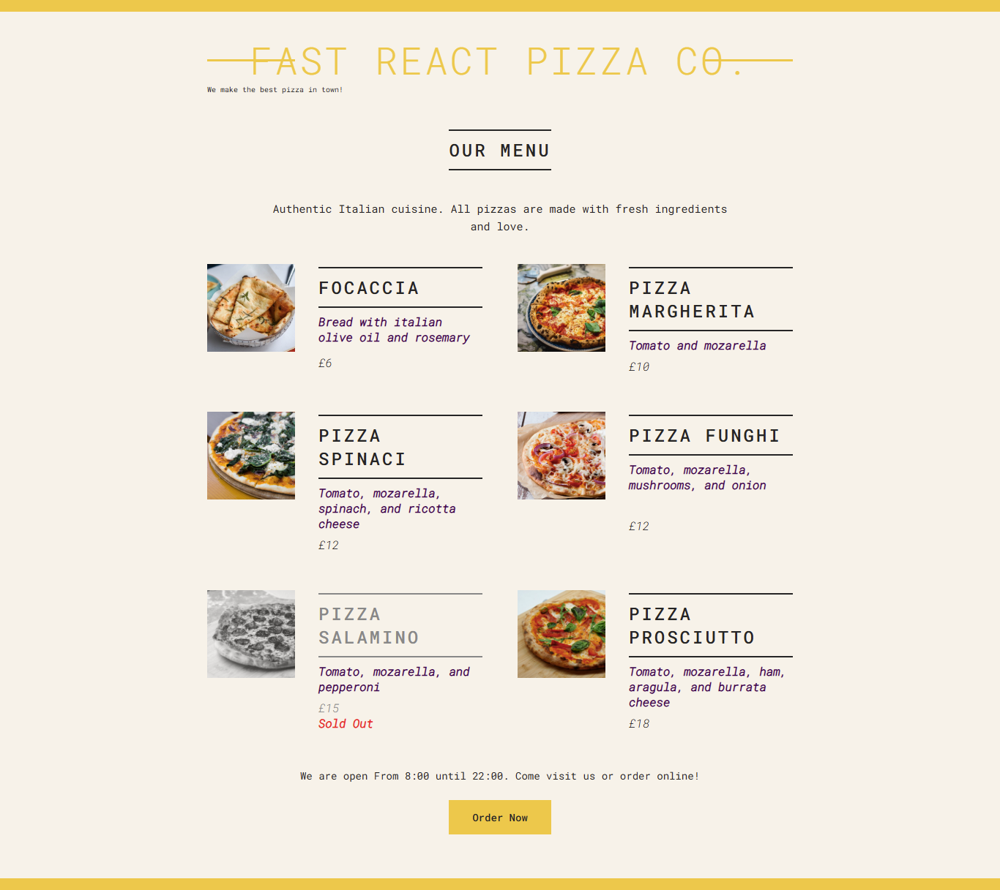

# 🍕 Fast React Pizza Co.

This is my **first React application**, built while following the **React - The Complete Guide** course by **Jonas Schmedtmann** on Udemy.

## 🚀 Project Overview

A beginner-friendly pizza menu app created to learn the fundamentals of React. It displays a list of pizzas with prices, ingredients, and availability.

## 📁 Features

- Displays a list of pizzas from an array (`pizzaData`)
- Shows sold-out status visually
- Dynamically updates based on business hours
- Built entirely with functional components and basic props

## 📷 Demo

  
*Sample pizza image used in the app*

## 🛠 Tech Stack

- React 19  
- JavaScript (ES6+)  
- HTML/CSS

## 🏗️ Components

- `App` – Root component  
- `Header` – App title and tagline  
- `Menu` – Displays pizza items  
- `Pizza` – Individual pizza card  
- `Footer` – Business hours and order button  
- `Order` – Displays order message and button

